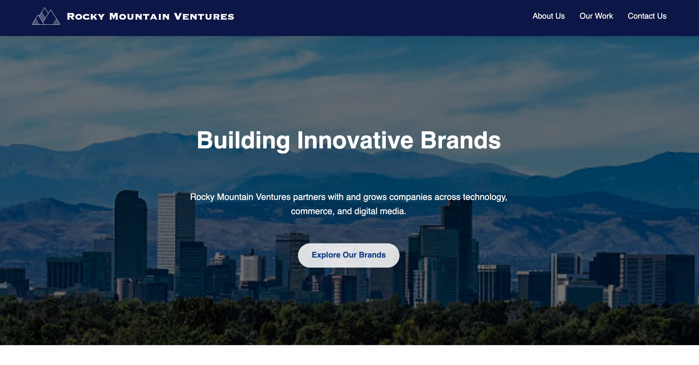

# Rocky Mountain Ventures Website

A responsive holding company website built using HTML, CSS, and JavaScript to showcase a fictional venture studio and its portfolio brands.

## Overview
This project demonstrates my ability to design and build a business website with a clean layout and interactive features. The site presents **Rocky Mountain Ventures** as a holding company that partners with and grows innovative digital brands, while highlighting portfolio companies and providing a contact form for partnership inquiries.

## Website Preview

## Features
- Responsive multi-section layout  
- Smooth scrolling navigation  
- Section fade-in animations on scroll  
- Portfolio brand cards with supporting descriptions and growth metrics  
- Contact form with built-in HTML validation  
- Clean and organized front-end code structure  

## Skills Demonstrated
- Front-end web development  
- Responsive layout design  
- User interface structuring   
- Website navigation and scrolling effects  

## Technologies Used
- HTML  
- CSS  
- JavaScript  

## Live Site
View the live website here:  
[Visit Website](https://ashleybonin.github.io/website-design-example/)

## Repository
Source code available here:  
[Repo Link](https://github.com/ashleybonin/website-design-example)
